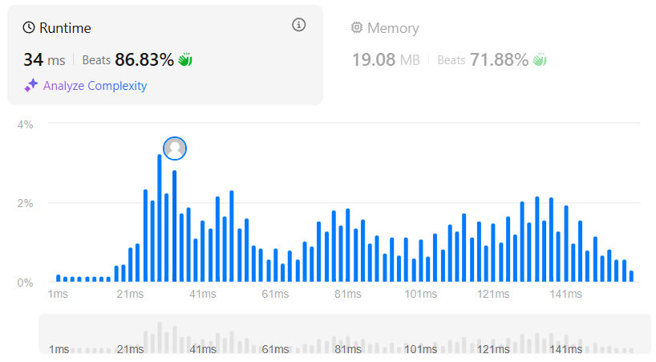

### 🎯 Problem: [Best Time to Buy and Sell Stock](https://leetcode.com/problems/best-time-to-buy-and-sell-stock/)

**Description:**

You are given an array `prices` where `prices[i]` is the price of a given stock on the `i`th day. You want to maximize your profit by choosing a single day to buy one stock and choosing a different day in the future to sell that stock. Return the maximum profit you can achieve.

📂 **Solution File**: [`best_time_to_buy_and_sell_stock.py`](best_time_to_buy_and_sell_stock.py)

---

### 📸 Results

      

