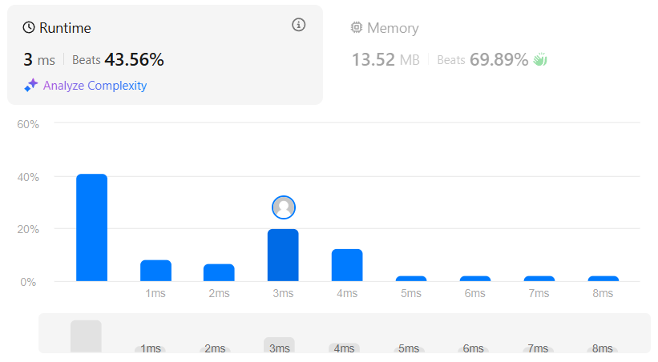
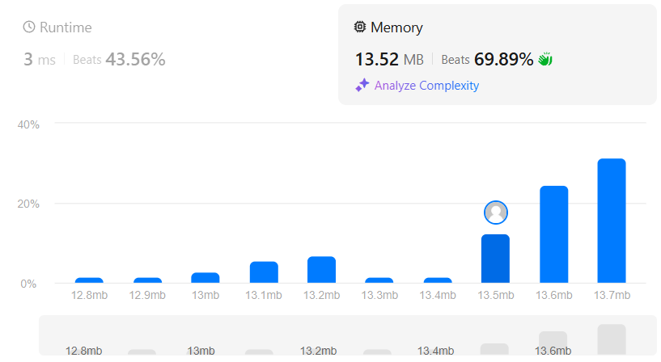

### 🎯 Problem: [Best Time to Buy and Sell Stock II](https://leetcode.com/problems/best-time-to-buy-and-sell-stock-ii/)

**Description:**

You are given an integer array `prices` where `prices[i]` is the price of a given stock on the `i`th day. You may complete as many transactions as you like (i.e., buy one and sell one share of the stock multiple times). Return the maximum profit you can achieve.

📂 **Solution File**: [`best_time_to_buy_and_sell_stock_II.py`](best_time_to_buy_and_sell_stock_II.py)

---

### 📸 Results

      

