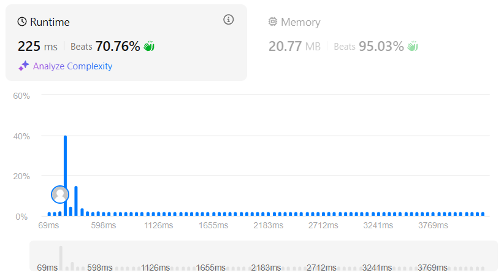
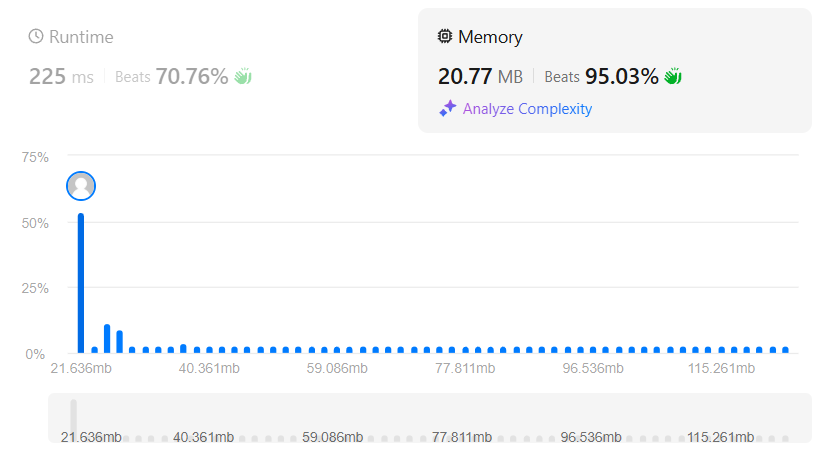

### 🎯 Problem: [Best Time to Buy and Sell Stock III](https://leetcode.com/problems/best-time-to-buy-and-sell-stock-iii/)

**Description:**

You are given an array `prices` where `prices[i]` is the price of a stock on the `i`th day. You are allowed to complete at most two transactions (i.e., buy one and sell one share of the stock two times). Return the maximum profit you can achieve.

📂 **Solution File**: [`best_time_to_buy_and_sell_stock_III.py`](best_time_to_buy_and_sell_stock_III.py)

---

### 📸 Results

      

