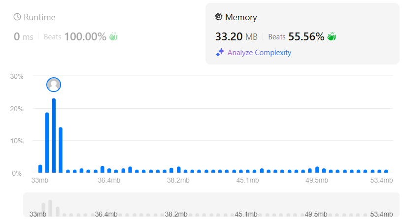

### 🎯 Problem: [Find Center of Star Graph](https://leetcode.com/problems/find-center-of-star-graph/)

**Description:**

A star graph is a graph where one center node is connected to all other nodes. Given an array of edges representing a star graph, return the center node.

📂 **Solution File**: [`find_center_of_star_graph.py`](find_center_of_star_graph.py)

---

### 📸 Results

      

