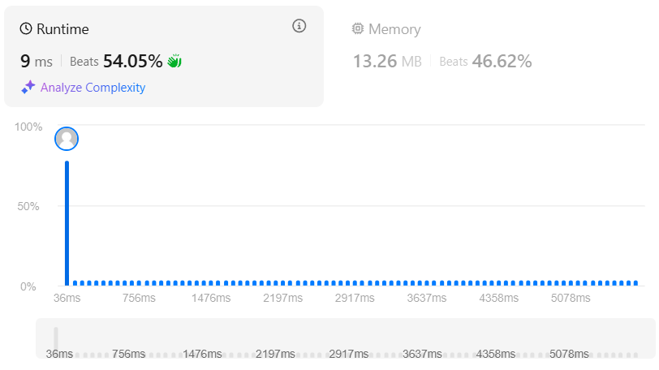

### 🎯 Problem: [Jump Game II](https://leetcode.com/problems/jump-game-ii/)

**Description:**

Given an array of non-negative integers `nums`, where each element represents your maximum jump length at that position, return the minimum number of jumps needed to reach the last index. You can always reach the end.

📂 **Solution File**: [`jump_game_II.py`](jump_game_II.py)

---

### 📸 Results

      

